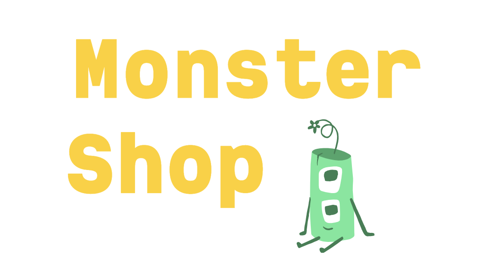
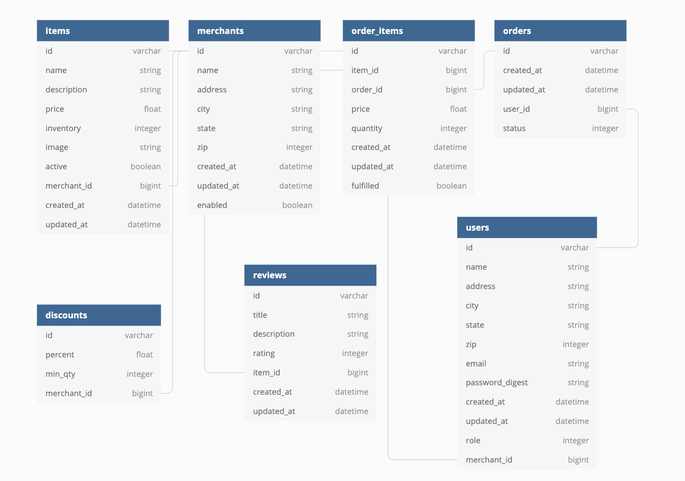

# Monster Shop Bulk Discount
BE Mod 2 Final Solo Project



## Background and Description

"Monster Shop" is a fictitious e-commerce platform where users can register to place items into a shopping cart and 'check out'. Users who work for a merchant can mark their items as 'fulfilled'; the last merchant to mark items in an order as 'fulfilled' will be able to get "shipped" by an admin. Each user role will have access to some or all CRUD functionality for application models.

Merchants can add bulk discount rates for all of their inventory. These apply automatically in the shopping cart, and adjust the order_items price upon checkout.

## Deployment

A deployment of the site is available [here](https://monster-shop-final-lriff.herokuapp.com/).

## Setup

### Prerequisites
- Ruby 2.5.3
- Rails 5.2.x

### Running Locally
```You should be able to access the app via [localhost:3000](http://localhost:3000/)
$ git clone git@github.com:leahriffell/monster_shop_final.git # or clone your own fork
$ cd monster_shop_final

Install gems and setup your database:
$ bundle install
$ rails db:create
$ rails db:migrate
$ rails db:seed

Run your own development server:
$ rails s (You should be able to access the app via http://localhost:3000/)
```

### Test suite
- Run with `$ bundle exec rspec`. There should be [X] passing tests.

## Data Structure

### Schema
**UPDATE THIS**


#### User Roles

1. Visitor - this type of user is anonymously browsing our site and is not logged in
2. Regular User - this user is registered and logged in to the application while performing their work; can place items in a cart and create an order
3. Merchant Employee - this user works for a merchant. They can fulfill orders on behalf of their merchant. They also have the same permissions as a regular user (adding items to a cart and checking out)
4. Admin User -  a registered user who has "superuser" access to all areas of the application; user is logged in to perform their work

#### Order Status

1. 'pending' means a user has placed items in a cart and "checked out" to create an order, merchants may or may not have fulfilled any items yet
2. 'packaged' means all merchants have fulfilled their items for the order, and has been packaged and ready to ship
3. 'shipped' means an admin has 'shipped' a package and can no longer be cancelled by a user
4. 'cancelled' - only 'pending' and 'packaged' orders can be cancelled

## Author
- [Leah Riffell](https://github.com/leahriffell)